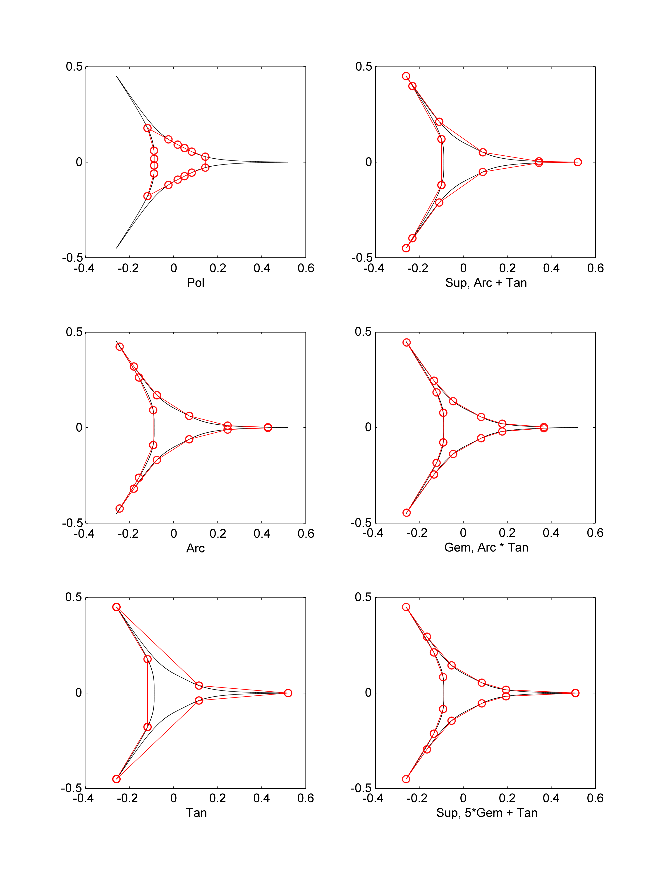

# ParamMixOptimize2D

A curve in 2 dimensional space can be parametrized in many different ways. Any mapping between a variable and points of a curve is a paramtrization of that curve, as long as there is one-to-one correspondence.

An example is curves generated by functions:
y = f(x)
x -> { x, f(x) }

Another example can be polar curves:
r = f(t)
t -> { f(t)cos(t), f(t)sin(t) }

There are also arc length parametrizations, curvature related parametrizations, etc.

Each curve has a definition parameter, that which, curve is algebraically defined as a function of it.
In polar curves, definition parameter is polar angle.
Other parametrizations, like arc length parametrization, is derived from definition parameter.
Derived parameters can also be represented as a function of the definition parameter.
This function will be monotonically increasing one-to-one function. So it can be invertible.
Every monotonically increasing one-to-one function represents a different parametrization.
These functions can be combined in different ways to generate new parametrizations.
This combination can also be optimized for minimizing/maximizing some other variable about the curve.
When new generated parameter function is inverted, new parameter becomes a free variable, and definition variable becomes a function of it.

See the PDFs in the pdf folder for more on the theory.

### Here is an image of how different parametrizations give different samples on a spiky superformula curve:
